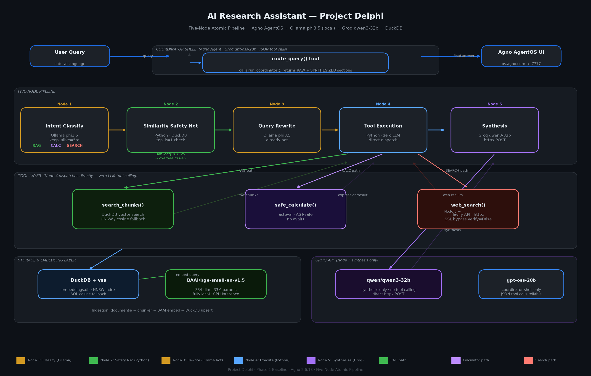

# AI Research Assistant — Project Delphi

## Overview

Project Delphi is a multi-agent AI research assistant built on a **five-node atomic pipeline architecture**. Queries flow through a local **Ollama phi3.5** intent classifier that understands the internal knowledge base, a **similarity-based safety net** that prevents KB content from being silently missed, a phi3.5 query rewriter (already hot in RAM via `keep_alive`), a **pure Python tool dispatcher with zero LLM tool-calling**, and finally **Groq qwen3-32b** for final answer synthesis only. The entire system is surfaced through **Agno AgentOS**, which exposes raw tool results in a dropdown and the synthesized answer in chat.

## Architecture Diagram



---

## Five-Node Pipeline

### Node 1 — Intent Classification (Ollama phi3.5, local)

- **Single job**: classify the query as `RAG`, `CALCULATOR`, or `SEARCH` — one word, nothing else
- Uses `keep_alive=5m` so phi3.5 stays loaded in RAM; Node 3 reuses the same hot model without a reload
- System prompt explicitly describes KB contents (AI architecture, RAG pipeline, agents, embeddings, project implementation details) so the model understands what internal knowledge exists
- Outputs exactly one word — malformed responses are caught and default to `RAG`
- Falls back to `keyword_fallback` routing if Ollama is unreachable

### Node 2 — Similarity Safety Net (Python, no LLM)

- **Only activates** when Node 1 classifies as `SEARCH`
- Runs an instant DuckDB vector similarity check (`top_k=1`) against the knowledge base
- If top chunk similarity > `0.25` → **overrides to RAG** (`routing_method = similarity_override`)
- If similarity ≤ `0.25` → **confirmed SEARCH**
- Prevents KB content from being missed on ambiguous queries (e.g. "What is the chunking overlap value?" is about a system config constant — it should hit RAG, not the web)
- Directly satisfies the case study requirement: _"Avoid always calling RAG with no decision logic"_

### Node 3 — Query Rewriting (Ollama phi3.5, already hot)

- **Single job**: rewrite the query for the target tool — no explanation, just the rewritten string
- Model already loaded in RAM from Node 1 via `keep_alive=5m` — no reload latency
- Three specialized system prompts, one per classification:
  - `CALCULATOR`: extract clean math expression asteval can evaluate (`three dozen eggs use half` → `(3 * 12) / 2`)
  - `RAG`: convert to keyword search query for DuckDB (`tell me about the architecture` → `architecture components design`)
  - `SEARCH`: rephrase as clean factual web search query (`who runs openai` → `OpenAI CEO 2025`)
- Strips chain-of-thought `<think>` blocks, takes first non-empty line only

### Node 4 — Direct Tool Execution (Python, zero LLM)

- **Single job**: call the correct tool with the rewritten query
- **Zero LLM involvement** — Python dispatches directly via `if/elif`, no model decides to call a tool
- `RAG` → `database.search_chunks()` → DuckDB HNSW vector search → raw chunks with similarity scores
- `CALCULATOR` → `safe_calculate()` → asteval evaluation → `Expression: X\nResult: Y`
- `SEARCH` → `web_search()` → Tavily API → `=== WEB SEARCH RESULTS ===` with titles, URLs, content
- Tool calling failures are impossible — there is no LLM layer to misformat a function call

### Node 5 — Answer Synthesis (Groq qwen3-32b)

- **Single job**: synthesize a clean final answer from the raw tool result only
- Never sees routing logic, classification labels, or the original pipeline
- Never calls tools — pure text generation from tool result content
- Strict system prompt: use only information from the tool result, no training data contamination
- For RAG: cites chunk number and source file
- For CALCULATOR: states the expression and computed result
- For SEARCH: cites source URLs from web results

---

## Agent Layer

### Coordinator

- Registered in **Agno AgentOS** as the single entry point for the UI
- Shell model: `openai/gpt-oss-20b` via Groq — the only Groq model confirmed to always emit JSON function calls (Llama and qwen models switch to Hermes XML format for "known" queries, which Groq rejects)
- Has a single tool: `route_query()` — runs the full five-node pipeline
- `tool_call_limit=1` — strictly one dispatch per query
- Returns the `=== SYNTHESIZED ANSWER ===` section verbatim to chat; raw tool result visible in tool dropdown

### Tool Functions (Pure Python)

| Function | File | Job |
|---|---|---|
| `safe_calculate(expression)` | `agents/calculator_agent.py` | asteval math evaluation |
| `document_lookup(query)` | `agents/rag_agent.py` | DuckDB vector search |
| `web_search(query)` | `agents/web_search_agent.py` | Tavily web search |

> These are **pure Python functions**, not Agno agents. They are called directly by Node 4 with no LLM intermediary.

---

## RAG Pipeline

1. **Document ingestion** — PDF (pypdf), Markdown, and plain-text files from `documents/` directory
2. **Structural/recursive chunking** — splits on Markdown headers (`#`) → double newlines → single newlines → hard character limit (`CHUNK_SIZE=500`, `CHUNK_OVERLAP=50`)
3. **Embedding** — `BAAI/bge-small-en-v1.5` (33M params, 384-dimensional, fully local, CPU inference, no API latency)
4. **Storage** — DuckDB + `vss` extension; chunks stored with their float vector embedding, source file, and chunk index
5. **Retrieval** — HNSW index vector search, returns top-`K` chunks (`TOP_K=5`) with cosine similarity scores; pure SQL `list_cosine_similarity` fallback if vss unavailable
6. **Context injection** — Node 4 returns raw chunks with source file and similarity score; shown explicitly in AgentOS tool call dropdown; Node 5 cites chunk number and source in final answer

---

## Tech Stack

| Component | Technology | Reason |
|---|---|---|
| UI | Agno AgentOS | Native tool visibility, chunk display, streaming |
| Classification | Ollama phi3.5 (local) | No rate limits, `keep_alive`, atomic single task |
| Query Rewriting | Ollama phi3.5 (local) | Already hot in RAM, atomic single task |
| Synthesis | Groq qwen3-32b | Strong instruction following, pure synthesis only |
| Coordinator shell | Groq gpt-oss-20b | Reliable JSON tool calling for AgentOS registration |
| Vector DB | DuckDB + vss | Embedded, in-process, SQL + vector simultaneously |
| Embeddings | BAAI/bge-small-en-v1.5 | 33M params, fully local, no API latency |
| Web Search | Tavily API | Structured results, purpose-built for LLM agents |
| Safe Math | asteval | AST-based, prevents arbitrary code execution |

---

## Design Decisions & Tradeoffs

**1. Why atomic nodes instead of compound LLM tasks**

Small models suffer attention dilution when asked to do multiple things in one prompt. A phi3.5 model asked to "classify AND rewrite" will sometimes produce a verbose explanation instead of a clean rewritten query, or conflate the two outputs. One job per node guarantees a predictable output format: Node 1 outputs exactly one word, Node 3 outputs exactly one rewritten query string. Each node is independently testable and debuggable. _Tradeoff_: more sequential LLM calls, slightly higher latency than a single compound prompt.

**2. Why Python dispatches tools directly instead of LLM tool calling**

Every LLM tool-calling failure we encountered during development was eliminated by removing the LLM from the dispatch path. Groq-hosted models (Llama, qwen, others) non-deterministically switch to Hermes XML format (`<function=name>{params}</function>`) for queries about "known" topics — Groq validates and rejects this format, causing tool call failures. Python dispatch via `if/elif` is 100% reliable and deterministic. _Tradeoff_: less flexible than dynamic multi-tool selection; only one tool is dispatched per query.

**3. Why `keep_alive` for Ollama**

Without `keep_alive`, Ollama unloads the model from RAM after the first request and must reload it from disk for the second. Model reload for phi3.5 adds 20–30 seconds of latency between Node 1 and Node 3. Setting `keep_alive=5m` keeps phi3.5 hot in RAM across both calls, reducing Node 3 latency to near-zero. _Tradeoff_: holds approximately 2.2GB of RAM for 5 minutes after the last request.

**4. Why KB description in Node 1 classification prompt**

Without a description of what the knowledge base contains, small models default to `SEARCH` for domain-specific queries they do not recognise as general world knowledge. The Node 1 system prompt explicitly lists KB topics (AI architecture, RAG pipeline, agent orchestration, embedding models, project implementation details). This lets phi3.5 make an informed routing decision: "What is the chunking overlap value?" is about an internal config constant, not web-searchable, and correctly routes to RAG. _Tradeoff_: longer system prompt, slightly more tokens per Node 1 call.

**5. Why similarity safety net in Node 2**

Even with a KB-aware classification prompt, edge cases slip through. Node 2 runs a DuckDB vector similarity check in milliseconds — if the top match exceeds `SIMILARITY_THRESHOLD=0.25`, the KB has relevant content and the query is overridden to RAG. This empirically confirms relevance rather than relying solely on model judgement. _Tradeoff_: every SEARCH query does one extra DuckDB lookup.

**6. Why qwen3-32b only for synthesis**

qwen3-32b produces significantly better final answers than phi3.5 for synthesis tasks — it follows complex formatting instructions reliably, cites sources coherently, and handles multi-part tool results cleanly. Crucially, synthesis requires no tool calling — the model only reads and writes. By confining qwen3-32b to Node 5, we avoid the problem where it answers "known" queries (math facts, world knowledge) directly without calling tools. _Tradeoff_: slower than smaller models; Groq rate limits apply on the free tier.

**7. Why DuckDB over a dedicated vector database**

DuckDB is embedded and runs in-process — zero infrastructure, no Docker, no separate service. It supports both standard SQL operations and vector search in the same database file. The pure SQL cosine similarity fallback (`list_cosine_similarity`) ensures the system functions even if the `vss` extension is unavailable. _Tradeoff_: not designed for production-scale concurrent writes; suited for single-user workloads.

**8. Why asteval over Python `eval()`**

Python's built-in `eval()` allows arbitrary code execution — passing `__import__('os').system('rm -rf /')` would be a critical security vulnerability. asteval compiles the input string to an Abstract Syntax Tree and evaluates only mathematical expressions, leaving all other constructs undefined. Shell commands, module imports, file operations, and attribute access are rejected at the AST validation stage. _Tradeoff_: full Python syntax is intentionally unsupported; only arithmetic and standard math functions work.

---

## Setup Instructions

### Prerequisites

- Python 3.10+
- [Ollama](https://ollama.ai) installed and running
- phi3.5 model pulled: `ollama pull phi3.5`
- Groq API key (free tier) — [console.groq.com](https://console.groq.com)
- Tavily API key (free tier) — [tavily.com](https://tavily.com)
- OpenRouter API key (optional) — [openrouter.ai](https://openrouter.ai)

### Installation

```bash
# 1. Clone the repository
git clone <repo-url>
cd MultiAgentAISystem_CaseStudy

# 2. Create and activate virtual environment
python -m venv venv
venv\Scripts\activate          # Windows
# source venv/bin/activate     # macOS / Linux

# 3. Install dependencies
pip install -r requirements.txt

# 4. Configure environment
copy .env.example .env         # Windows
# cp .env.example .env         # macOS / Linux
# Edit .env and fill in your API keys

# 5. Initialize database
python database.py

# 6. Ingest documents
python ingest.py

# 7. Start Ollama (separate terminal)
ollama serve

# 8. Start AgentOS UI server
python app.py
# Open https://os.agno.com and connect to http://localhost:7777

# OR start REST API server
uvicorn main:app --reload --port 8000
```

### Environment Variables

Copy `.env.example` to `.env` and fill in your keys:

```env
OPENROUTER_API_KEY=your_openrouter_key_here
GROQ_API_KEY=your_groq_key_here
TAVILY_API_KEY=your_tavily_key_here
OPENROUTER_BASE_URL=https://openrouter.ai/api/v1
LLM_MODEL=meta-llama/llama-3.3-70b-instruct
GROQ_BASE_URL=https://api.groq.com/openai/v1
GROQ_MODEL=qwen/qwen3-32b
OLLAMA_BASE_URL=http://localhost:11434
OLLAMA_ROUTING_MODEL=phi3.5
```

### REST API Usage

```bash
# Health check
curl http://localhost:8000/health

# RAG query — answered from internal KB
curl -s -X POST http://localhost:8000/query \
  -H "Content-Type: application/json" \
  -d '{"query": "What embedding model is used in this system?"}' | python -m json.tool

# Calculator query
curl -s -X POST http://localhost:8000/query \
  -H "Content-Type: application/json" \
  -d '{"query": "What is 15 percent of 240?"}' | python -m json.tool

# Web search query
curl -s -X POST http://localhost:8000/query \
  -H "Content-Type: application/json" \
  -d '{"query": "Who is the current CEO of OpenAI?"}' | python -m json.tool

# List ingested chunks
curl "http://localhost:8000/chunks?limit=20"
```

---

## Common Pitfalls Addressed

**"Always calling RAG (no decision logic)"**
Node 1 classifies intent with a KB-aware system prompt. Node 2 similarity check empirically confirms KB relevance before routing. Math queries go to Calculator, general world knowledge goes to Web Search. RAG is only invoked when the KB is confirmed to have relevant content.

**"Not showing retrieved context"**
Node 4 returns raw chunks with source file name and cosine similarity score. These are displayed verbatim in the AgentOS tool call dropdown. Node 5 cites the chunk number and source file in the synthesized final answer.

**"Hardcoded or shallow implementations"**
Five-node atomic pipeline with distinct responsibilities. `keep_alive=5m` optimization for local model hot-loading. Pure SQL cosine fallback for DuckDB vss unavailability. Similarity safety net for routing edge cases. Idempotent database initialization. Async SSL handling for corporate proxy environments.

**"Fake multi-agent setups (no real separation)"**
Each tool function (`safe_calculate`, `document_lookup`, `web_search`) has a distinct, non-overlapping responsibility. The Coordinator never answers queries directly — it always calls `route_query`. Each node has a single job with no overlap. The synthesis node never sees the routing logic; the routing nodes never do synthesis.

---

## Evaluation Criteria Mapping

| Criterion | Implementation |
|---|---|
| Agent Design — clear reasoning | Five atomic nodes, each with single job, no LLM tool calling |
| RAG Quality — relevant retrieval | Structural chunking + HNSW search + similarity safety net |
| Tool Usage — structured and meaningful | Python direct dispatch, typed inputs, formatted outputs |
| System Design — modular and clean | Separate files per concern, `config.py`, `llm_client.py` |
| Code Quality — readability | Docstrings on all nodes, typed returns, logged at every step |
| Thinking — depth in README | This document |

---

## Bonus Features Implemented

| Bonus | Implementation |
|---|---|
| Query classification before routing | Node 1 Ollama phi3.5 with explicit KB description in system prompt |
| Avoid unnecessary RAG calls | Node 2 similarity safety net + CALCULATOR and SEARCH paths |
| Logging / tracing | Every node logs classification, rewrite, tool result, routing method |
| Performance optimizations | `keep_alive=5m`, local embeddings (no API), in-process DuckDB |

---

## Project Structure

```
MultiAgentAISystem_CaseStudy/
├── app.py                  # Agno AgentOS entry point (port 7777)
├── main.py                 # FastAPI REST API (port 8000)
├── config.py               # All constants and API keys (loaded from .env)
├── database.py             # DuckDB init, embed, search_chunks, vss fallback
├── ingest.py               # Document parsing, chunking, embedding, upsert
├── llm_client.py           # get_synthesis_model() factory (qwen3-32b)
├── requirements.txt        # Python dependencies
├── .env.example            # Environment variable template (committed)
├── .env                    # Actual API keys (NOT committed)
│
├── agents/
│   ├── coordinator.py      # Five-node pipeline: _classify, _similarity_check,
│   │                       #   _rewrite, _execute_tool, _synthesize, run_coordinator
│   ├── rag_agent.py        # document_lookup() — pure Python function
│   ├── calculator_agent.py # safe_calculate() — asteval, pure Python function
│   └── web_search_agent.py # web_search() — httpx to Tavily, pure Python function
│
├── documents/              # Source documents for RAG knowledge base
│   ├── architecture.md     # System architecture documentation
│   └── overview.txt        # Project overview (plain text)
│
├── docs/
│   ├── architecture.png    # Five-node pipeline diagram (generated)
│   └── generate_diagram.py # Matplotlib script to regenerate diagram
│
└── db/                     # DuckDB database (gitignored — created at runtime)
    └── embeddings.db
```
